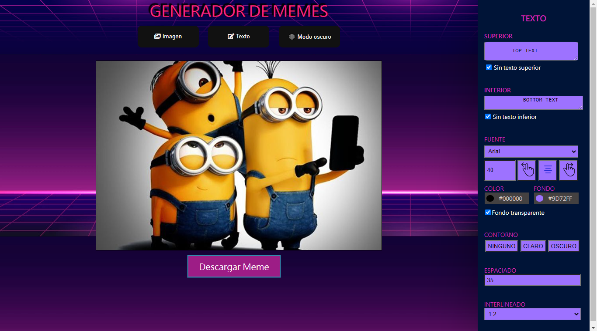
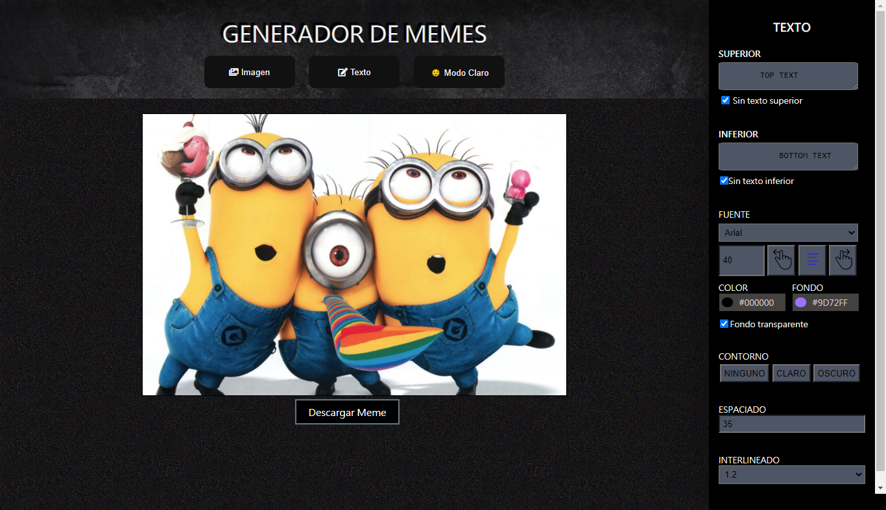
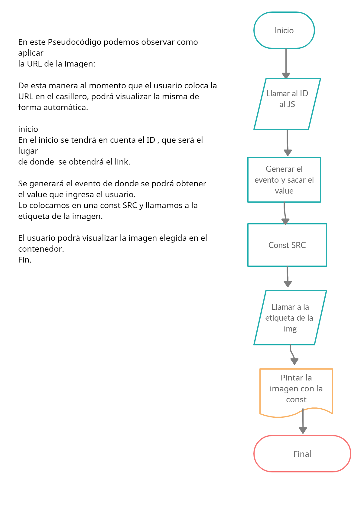

# Editor de memes by: Raquel Muriega 👩🏼‍💻

### En este proyecto podrás encontrar todo el contenido abordado hasta el momento en las clases de Ada, con respecto al segundo módulo, en base a JavaScript.
<br>


### Durante la elaboración del proyecto, se trabajó con distintos tipos de desafios relacionados a lo visto en las clases sobre JavaScript y su interaccion con HTML y CSS. El proyecto está diseñado con el fin de poder ser utilizado por distintos usuarios para personalizar y elaborar desde el comienzo, sus propios memes. 
### Este proyecto cuenta con dos estilos distintos, por un lado se inicia con el modo de visualización claro, y si desea el usuario podrá pasar (simplemente con un click) al modo de visualización oscuro.  
<br>

### 📌Si querés ver como  quedó el proyecto podes hacerlo desde [acá](https://eager-brahmagupta-34b3fc.netlify.app)
<br>

***

# Si querés tener el código en tu computadora, deberás seguir estos pasos en tu terminal.


 - Ir al [repositorio](https://github.com/ReyMga/Proyecto-EditorDeMemes)


 - Darle click al botón de forkear


 - Darle click al botón de code

 - Copiar la URL

 - Abrir tu terminal y poner el comando de 
 ``` git clone  <url> ```

 - Entrar a la carpeta del proyecto y abrirlo en tu IDE

### Este proyecto no necesita la instalación de ninguna dependencia, por ahora!✋🏼

<br>
***

## Construido con 🛠️

#### [HTML](https://es.wikipedia.org/wiki/HTML)
#### [CSS](https://es.wikipedia.org/wiki/Hoja_de_estilos_en_cascada)
#### [JAVASCRIPT](https://www.javascript.com/)

***

### _Acá podes ver como quedaría el proyecto en el modo claro_



<br>

### _Acá podes ver como quedaría el proyecto en el modo Oscuro_



***


### Aquí se adjuntan algunos Pseudocódigos correspondientes al proyecto:  


# Expresiones de Gratitud 🎁

### Este proyecto se hizo posible gracias a la  ayuda y  guía de nuestro profe [Jonhks](https://github.com/Jonhks) & [Leydy](https://github.com/leydyk93/)

<br>

***

### De Raquel 🖤🧡